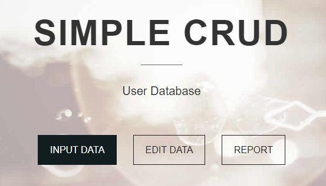

# Simple CRUD Application with PHP & MySQL

A simple web application built using native PHP and MySQL to demonstrate the fundamental CRUD (Create, Read, Update, Delete) operations. This project was developed as a learning exercise to understand database interaction, server-side scripting, and responsive web development using Bootstrap.

---

## Preview



> Additional screenshots are available in the **screenshots/** folder.

---

## Features

- Create new user records
- View existing records
- Update user information
- Delete records
- MySQL database integration
- Responsive user interface with Bootstrap
- Simple reporting page

---

## Tech Stack

- PHP (Native PHP)
- MySQL
- HTML5
- CSS3
- Bootstrap
- JavaScript

---

## Project Structure

```text
simple-crud-php-mysql/
│
├── assets/                          
│   ├── css/
│   ├── fonts/
│   ├── img/
│   ├── js/
│   ├── connect.php
│   ├── delete.php
│   ├── edit.php
│   ├── edit_user.php
│   ├── index.php
│   ├── input.php
│   └── report.php
│
├── screenshots/                        
│   ├── edit.png
│   ├── index.png
│   ├── input.png
│   ├── report.png
│   └── search.png
│
├── LICENSE
└── README.md
```

---

## Installation

### Prerequisites

- PHP 7.0 or later
- MySQL
- Apache (XAMPP, Laragon, or WAMP)

### Steps

1. Clone this repository

```bash
git clone https://github.com/septharie/simple-crud-php-mysql.git
```

2. Place the project inside your web server directory.

Example (XAMPP):

```text
htdocs/simple-crud-php-mysql
```

3. Create a MySQL database.

4. Configure your database connection in `connect.php`.

5. Start Apache and MySQL.

6. Open your browser and visit:

```text
http://localhost/simple-crud-php-mysql
```

---


## Learning Outcomes

This project helped me strengthen my understanding of:

- PHP programming fundamentals
- CRUD operations
- MySQL database connectivity
- SQL queries
- HTML forms and data processing
- Bootstrap-based responsive layouts
- Organizing a small PHP application

---

## Future Improvements

- User authentication and authorization
- Search and filtering
- Pagination
- Server-side form validation
- Prepared statements (PDO/MySQLi)
- Export reports to Excel or PDF

---

## License

This project is available under the MIT License.
